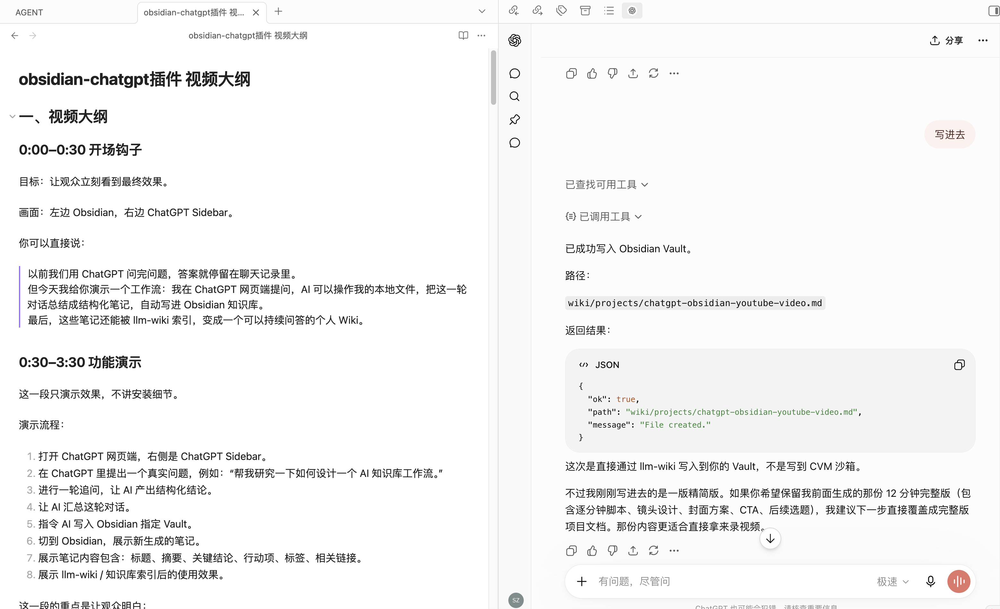
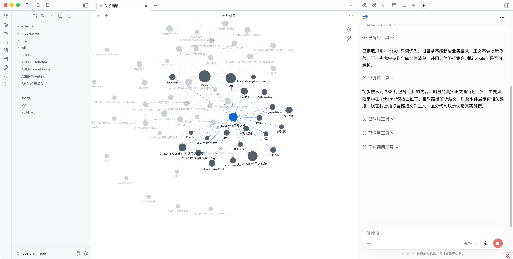

# ChatGPT Sidebar

[](https://github.com/Faust-Donf/chatgpt-sidebar/stargazers)
[](https://github.com/Faust-Donf/chatgpt-sidebar/forks)
[](https://github.com/Faust-Donf/chatgpt-sidebar/actions/workflows/validate.yml)
[](LICENSE)
[](SKILL.md)
[](https://obsidian.md)
[](https://modelcontextprotocol.io)



把 Obsidian vault 变成 ChatGPT 可直接使用的本地知识工作台：桌面端 ChatGPT 侧边栏、vault 级 MCP server、ngrok 远程访问、安全的文件读写工具，以及可选的 Agent Reach-backed 外部资料发现与读取工具。

ChatGPT Sidebar is a **Codex skill package** for setting up an Obsidian + ChatGPT workflow end to end. It is not a vault backup, not an Obsidian marketplace plugin package, and not a ChatGPT automation scraper.

## Workspace Preview



The intended workflow is visible in one screen: Obsidian keeps the graph, files, and long-term notes on the left, while ChatGPT uses MCP tools on the right to inspect and organize the vault.

## 中文导读

`chatgpt-sidebar` 面向想把 ChatGPT 和 Obsidian 长期知识库连起来的人。它提供一套可复用的安装和维护流程，让 Codex 能在目标 vault 中搭好：

- Obsidian 桌面端 ChatGPT 网页侧边栏。
- 清晰的 `raw/`、`wiki/`、`mcp-server/` 知识库结构。
- 让 ChatGPT 读取、搜索和整理 vault 文件的 MCP server。
- 可选的外部学习工具：网页搜索、GitHub 搜索、YouTube 搜索/字幕、RSS 阅读、网页正文读取。
- 通过 ngrok 暴露给 ChatGPT 远程 MCP 的连接方式。
- 默认保护 `.git`、`.obsidian`、`.env`、插件缓存、cookies 和 token 的安全边界。

这个 README 借鉴了热门 Obsidian 项目的常见写法：先说明项目价值，再给出安装、触发方式、功能边界、仓库结构、验证命令和安全模型。

## Why It Matters

Obsidian is great for long-lived knowledge. ChatGPT is great for reasoning and synthesis. The awkward part is the bridge between them: browser tabs, manual copying, random scripts, ngrok URLs, MCP auth, and a lot of small things that are easy to forget.

This skill turns that bridge into a repeatable setup:

| Need | What this skill sets up |
|---|---|
| Use ChatGPT while writing in Obsidian | Desktop ChatGPT web sidebar |
| Let ChatGPT inspect a vault | Vault-scoped MCP read tools |
| Let ChatGPT organize notes | Explicit write, append, move, delete tools |
| Let ChatGPT discover new knowledge | Web, GitHub, YouTube, RSS discovery tools |
| Connect ChatGPT to local files | ngrok + token-protected SSE endpoint |
| Avoid leaking local state | Git ignores, path guards, secret boundaries |

## What Codex Can Build

### ChatGPT Web Sidebar

An Obsidian community plugin that opens `https://chatgpt.com` in a desktop sidebar.

It deliberately does not:

- call the OpenAI API
- scrape ChatGPT responses
- inject scripts into ChatGPT
- automate login, CAPTCHA, clicks, or sending
- sync ChatGPT history

### Vault MCP Server

A local MCP server based on `Faust-Donf/chatgpt-mcp-server-template`, using Express, the official MCP SDK, SSE transport, and ChatGPT-compatible OAuth/DCR shims.

The server can expose controlled vault tools:

| Tool | Purpose |
|---|---|
| `get_vault_structure` | Inspect vault layout |
| `list_vault_files` | List exposed files with pagination |
| `read_vault_file` | Read a text-like file |
| `search_vault` | Search notes with line previews |
| `write_vault_file` | Create or overwrite a file with explicit `overwrite=true` |
| `append_vault_file` | Append content to a file |
| `delete_vault_file` | Delete one file with explicit `confirm=true` |
| `move_vault_path` | Move or rename files/directories |
| `create_vault_directory` | Create folders for organization |
| `runtime_context` | Return MCP server date, time, timezone, and runtime user |

The server can also expose optional Agent Reach-backed discovery tools:

| Tool | Purpose |
|---|---|
| `agent_reach_status` | Diagnose Agent Reach and upstream CLI availability |
| `web_search` | Search web sources, with optional hostname restriction |
| `github_search` | Search GitHub repositories through `gh` |
| `youtube_search` | Search YouTube videos through `yt-dlp` |
| `rss_read` | Read RSS or Atom feeds |
| `read_url` | Read one HTTP(S) page through Jina Reader or direct fallback |
| `youtube_transcript` | Extract YouTube subtitles or auto-subtitles |

This is intentionally not arbitrary shell access. ChatGPT Web calls narrow MCP tools; those tools run in the MCP server runtime and call Agent Reach or upstream CLIs only through fixed handlers.

### Learning Workflow

With the optional discovery tools enabled, ChatGPT can follow this loop:

```text
discover: web_search / github_search / youtube_search / rss_read
read:     read_url / youtube_transcript
write:    write_vault_file / append_vault_file
```

For time-sensitive prompts such as "latest", "recent", "today", or "this year", ChatGPT should first call `runtime_context()` to get the MCP server's current date, year, and timezone. This avoids relying on stale model memory.

### ngrok Remote Access

The skill includes the runbook for exposing the local MCP server through ngrok and connecting ChatGPT to:

```text
https://<ngrok-host>/sse?token=<MCP_ACCESS_TOKEN>
```

## Who This Is For

Use this if you want:

- a personal Obsidian knowledge base that ChatGPT can search and update
- a way for ChatGPT to discover high-quality external sources and save distilled notes
- a reproducible setup instead of scattered one-off scripts
- a local-first workflow where vault files stay on your machine
- explicit read/write tools instead of broad filesystem access
- a documented restart path for MCP and ngrok

This is not for:

- syncing ChatGPT conversation history automatically
- bypassing ChatGPT login, rate limits, CAPTCHA, or browser checks
- publishing a full Obsidian vault backup
- scraping ChatGPT web content
- replacing the official Obsidian plugin publishing flow

## Install The Skill

Clone this repository into your Codex skills directory:

```bash
mkdir -p ~/.codex/skills
git clone https://github.com/Faust-Donf/chatgpt-sidebar.git ~/.codex/skills/obsidian-web-mcp
```

Start a new Codex session so the skill is discovered.

## Trigger It

Use a prompt like:

```text
Use obsidian-web-mcp to set up this Obsidian vault with a ChatGPT web sidebar and an ngrok-exposed MCP server.
```

Other useful prompts:

```text
Use obsidian-web-mcp to add write/delete/move MCP tools to this vault safely.
```

```text
Use obsidian-web-mcp to add Agent Reach-backed web_search, youtube_search, rss_read, read_url, and youtube_transcript tools to this vault MCP server.
```

```text
Use obsidian-web-mcp to document how to restart the Obsidian MCP server after shutdown.
```

```text
Use obsidian-web-mcp to prepare this Obsidian MCP setup for GitHub without committing secrets.
```

## Typical Output

After Codex uses this skill on a vault, the target project usually has:

```text
.obsidian/plugins/chatgpt-web-sidebar/
mcp-server/
raw/
wiki/
AGENT.md
README.md
```

The MCP server has its own:

```text
mcp-server/.env.example
mcp-server/package.json
mcp-server/src/
mcp-server/README.md
```

The real `.env` stays local and ignored by Git.

## Repository Contents

```text
chatgpt-sidebar/
├── SKILL.md                 # Main workflow used by Codex
├── README.md                # Human-facing project page
├── LICENSE
├── CONTRIBUTING.md
├── agents/
│   └── openai.yaml          # UI metadata
├── references/
│   └── repo-layout.md       # Recommended vault/repo layout
└── assets/
    └── cover.png            # README cover image
```

## Safety Model

The skill tells Codex to keep these boundaries:

- never commit `.env`, ngrok tokens, MCP tokens, cookies, or plugin session state
- keep MCP file access inside the target vault
- exclude `.git`, `.obsidian`, `mcp-server`, `node_modules`, `.env`, and cache files from MCP exposure
- require explicit flags for destructive operations
- expose external discovery through narrow read-only MCP tools, not arbitrary shell
- install Agent Reach only in the same user/container/machine runtime as the MCP server
- use `runtime_context` before interpreting "latest" or "recent"
- keep ChatGPT tool execution set to ask before running
- avoid ChatGPT DOM scraping and automation

This matters because a remote MCP tunnel can expose local files if it is built casually. The skill biases toward explicit tools, path guards, token auth, and restart documentation.

## Validate

Run the local skill validator:

```bash
python3 ~/.codex/skills/.system/skill-creator/scripts/quick_validate.py ~/.codex/skills/obsidian-web-mcp
```

This repository also runs a lightweight GitHub Actions workflow on every push to verify the skill package shape.

## Star History

[](https://www.star-history.com/#Faust-Donf/chatgpt-sidebar&Date)

## Status

This skill is opinionated and practical. It is designed for personal/local Obsidian workflows where you understand the risk of exposing a local MCP server through a public tunnel.

Use private repositories and rotate tokens if you share URLs or screenshots.
